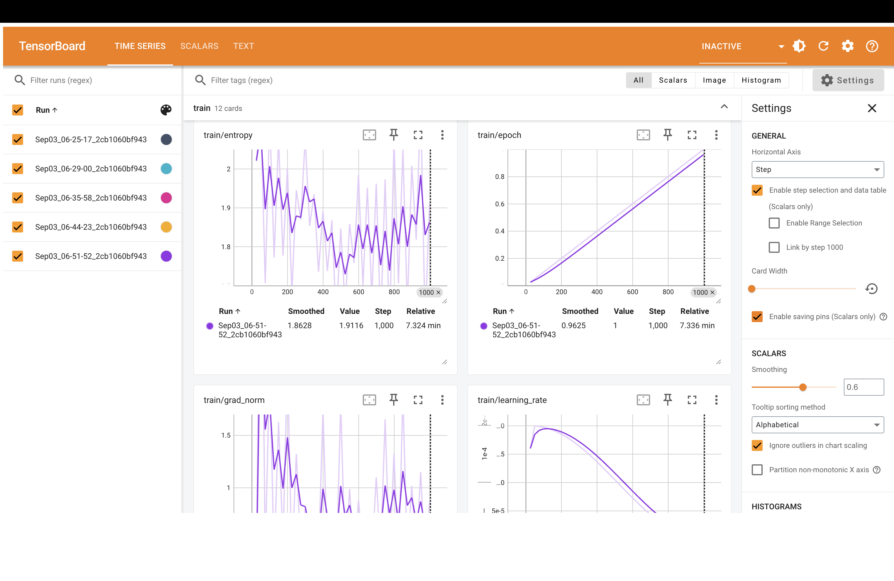
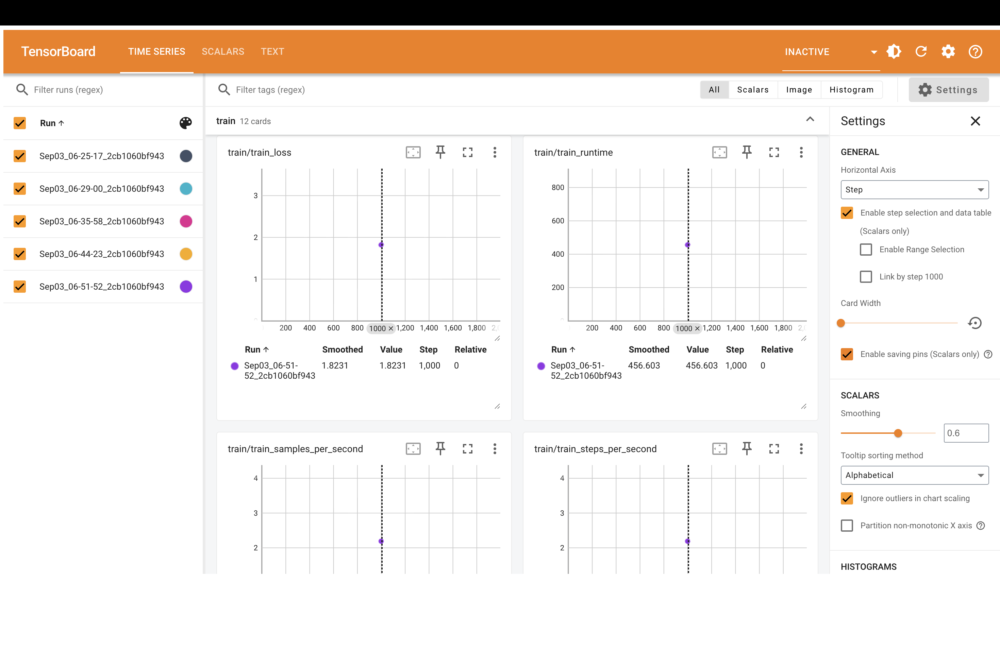

# 🚀 Fine-Tuning Falcon-RW-1B with QLoRA

This project demonstrates how to **fine-tune a large language model (Falcon-RW-1B)** using **QLoRA** on a **custom instruction dataset**.  
The goal was to build a resource-efficient chatbot capable of answering questions in a conversational style.

---

## 📌 Project Overview

- **Base Model** → Falcon-RW-1B 
- **Dataset Used** → Guanaco-LLaMA2-1K (instruction-tuning dataset)
- **Fine-Tuning Method** → **QLoRA** (Quantized LoRA) 
- **Frameworks & Tools** → Hugging Face Transformers, TRL, PEFT, BitsAndBytes, TensorBoard
- **Output** → A fine-tuned chatbot model saved as falcon-1b-finetune


---

## ⚡ Why QLoRA?

- Fine-tuning large models is **memory heavy.**
- LoRA trains only **small adapter layers,** but still requires model in full precision.
- **QLoRA** combines LoRA +**4-bit quantization,** allowing fine-tuning on **smaller GPUs** with much lower VRAM usage.

---

## 🛠 Tech Stack

- **Hugging Face Transformers** → Load & manage LLMs.
- **TRL (Transformers Reinforcement Learning)** → Provides SFTTrainer for supervised fine-tuning.
- **PEFT (Parameter-Efficient Fine-Tuning)** → Implements LoRA adapters. 
- **BitsAndBytes (bnb)** → Enables 4-bit quantization for QLoRA.
- **TensorBoard** → Training visualization (loss curves, logs).
- **PyTorch** → Core deep learning framework.

---

## 🔧 Training Configuration

### LoRA Parameters
- **lora_r = 64** → Rank of LoRA matrices
- **lora_alpha = 16** → Scaling factor
- **lora_dropout = 0.1** → Prevents overfitting

### Quantization Parameters (QLoRA)
- **use_4bit = True** → Enable 4-bit quantization
- **bnb_4bit_compute_dtype = "float16"** → Math done in half precision
- **bnb_4bit_quant_type = "nf4"** → NormalFloat4 (better accuracy)
- **use_nested_quant = False** → No double quantization

### Training Arguments
- **epochs = 1** → Trained for 1 pass over dataset
- **batch_size = 4** → Training batch size
- **gradient_checkpointing = True** → Saves GPU memory
- **learning_rate = 2e-4** → Optimizer learning rate
- **lr_scheduler = cosine** → Learning rate decay strategy
- **logging_steps = 25** → Log every 25 steps
- **report_to = "tensorboard"** → Logs to TensorBoard

---

## 📉 Training Visualization (TensorBoard)

- During training, TensorBoard was used to track progress:

- **Training Loss Curve** → Shows model improving over steps.
- **Logs** → Training speed, memory usage, optimizer info.

- **Command to launch TensorBoard:**
   ```bash
   %load_ext tensorboard
   %tensorboard --logdir results/runs

---

## 📷 Screenshots  

  

  

---
## 📊 Training Workflow

- **Load Dataset** → Instruction dataset (guanaco-llama2-1k) with question-answer pairs.
- **Load Base Model** → Falcon-RW-1B loaded in 4-bit precision.
- **Attach LoRA Adapters** → Small trainable layers added.
- **Fine-Tune with TRL’s SFTTrainer** → Only LoRA parameters trained, base model stays frozen.
- **Monitor Training** → Loss visualized in TensorBoard.
- **Save Fine-Tuned Model** → Exported to falcon-1b-finetune.

---

